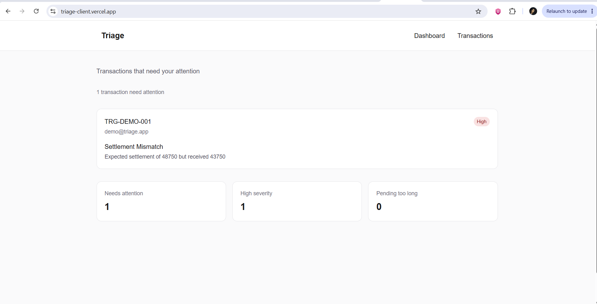
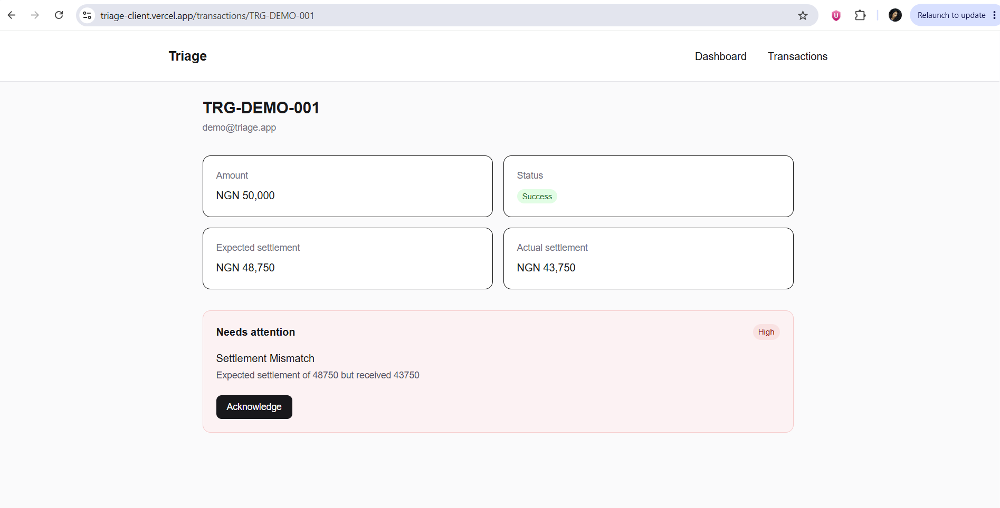
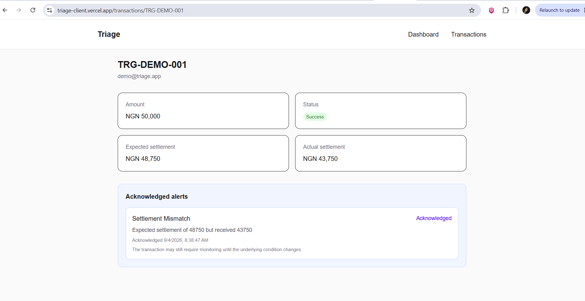
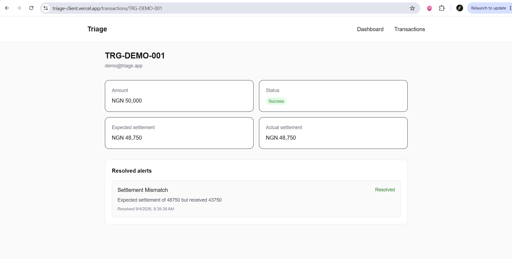

# Triage

An exception-first payment operations dashboard that helps operators focus on transactions that actually require attention.

Instead of treating every transaction equally, Triage evaluates transaction data against operational rules, surfaces exceptions, explains why they were flagged, and tracks alerts from detection through acknowledgement and resolution.

## Live Demo

[Triage Live Application](https://triage-client.vercel.app)

## Screenshots

### 1. Exception-first dashboard


### 2. Open alert


### 3. Alert acknowledgement


### 4. Automatic resolution


## Why Triage?

Payment operations teams can process large numbers of transactions while only a small percentage require manual investigation.

Triage is built around a simple idea:

> Surface the exceptions, explain the problem, and keep them visible until the underlying issue is actually resolved.

The dashboard provides an attention queue rather than forcing an operator to manually inspect every transaction.

## Features

### Attention Dashboard

The main dashboard gives operators an immediate view of transactions requiring action.

It includes:

- Total transactions needing attention
- High-severity issue count
- Transactions stuck in pending
- Searchable attention queue
- Severity indicators
- Transaction status
- Clear empty state when no active issues remain

### Transaction Management

The transactions view provides:

- Complete transaction history
- Search by reference or customer
- Status filtering
- Transaction amount and currency
- Transaction status
- Issue indicators
- Navigation to individual transaction details

### Transaction Details

Each transaction has a dedicated detail view showing:

- Transaction reference
- Customer
- Amount
- Current transaction status
- Expected settlement
- Actual settlement
- Active issue reason
- Issue severity
- Alert state
- Historical resolved alerts

This allows an operator to understand both the current transaction state and the operational history around it.

## Alert Lifecycle

Triage distinguishes between reviewing an issue and actually fixing it.

```text
OPEN → ACKNOWLEDGED → RESOLVED
```

### OPEN

The underlying issue is active and requires attention.

### ACKNOWLEDGED

An operator has reviewed the alert.

Acknowledging an alert does **not** mean that the underlying transaction problem has disappeared.

### RESOLVED

The transaction changes and the condition that originally triggered the alert no longer applies.

The backend automatically resolves the stale alert while preserving it as part of the transaction's history.

This distinction prevents reviewed-but-unfixed problems from being incorrectly presented as resolved.

## Exception Rules

Triage currently detects:

- Failed transactions
- Reversed transactions
- Transactions stuck in pending
- Settlement mismatches

Examples of rule explanations include:

```text
Transaction with reference TRG-FAILED-001 has failed.
```

and settlement discrepancies where the expected and actual settlement values differ.

## Example Workflow

```text
Transaction received
        ↓
Rules evaluated
        ↓
Issue detected
        ↓
OPEN alert created
        ↓
Appears in attention queue
        ↓
Operator acknowledges alert
        ↓
ACKNOWLEDGED
        ↓
Transaction state changes
        ↓
Rule no longer matches
        ↓
RESOLVED
        ↓
Alert preserved in transaction history
```

## Tech Stack

### Frontend

- Next.js
- React
- TypeScript
- Tailwind CSS

### Backend

- Node.js
- Express
- TypeScript
- PostgreSQL
- Prisma
- Zod

### Testing

- Vitest
- Supertest

### Deployment

- Vercel — frontend
- Render — API
- Supabase — PostgreSQL database

## Frontend Structure

```text
app/
├── components/
│   ├── AcknowledgeAlertButton.tsx
│   ├── Header.tsx
│   ├── SeverityBadge.tsx
│   ├── StatusBadge.tsx
│   ├── SummaryCard.tsx
│   ├── TransactionCard.tsx
│   └── TransactionsTable.tsx
│
├── transactions/
│   ├── [reference]/
│   │   └── page.tsx
│   └── page.tsx
│
├── types/
│   └── transaction.ts
│
├── utils/
│   ├── api.ts
│   └── formatters.ts
│
├── globals.css
├── layout.tsx
└── page.tsx
```

## Architecture

Triage separates the user interface from the transaction evaluation system.

```text
Next.js Dashboard
        ↓
Express API
        ↓
Transaction Service
        ↓
Rules Engine
        ↓
Alert Service
        ↓
PostgreSQL
```

The frontend consumes the API and focuses on presenting operational state clearly, while transaction evaluation and alert lifecycle decisions remain on the backend.

## Running Locally

### 1. Clone the repository

```bash
git clone https://github.com/Liciacodes/triage-client.git
cd triage-client
```

### 2. Install dependencies

```bash
npm install
```

### 3. Configure the API URL

Create a `.env.local` file:

```env
NEXT_PUBLIC_API_URL=http://localhost:3000
```

### 4. Start the development server

```bash
npm run dev
```

Open the local Next.js application in your browser.

## Production

The frontend is deployed on Vercel:

[Triage Live Application](https://triage-client.vercel.app)

The API is deployed separately on Render:

[Triage API](https://triage-api-fg04.onrender.com)

## Backend Repository

The rules engine, transaction processing, alert lifecycle, persistence, and API are maintained in the separate Triage API repository:

[Triage API Repository](https://github.com/Liciacodes/triage-api)